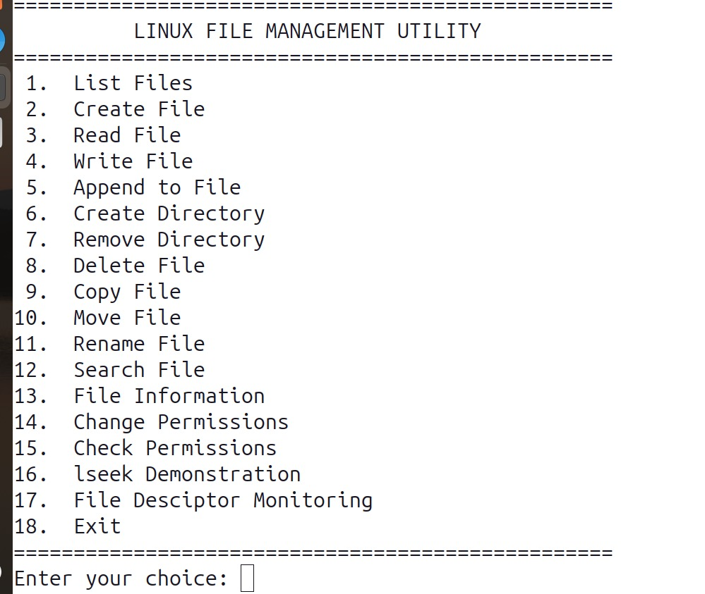
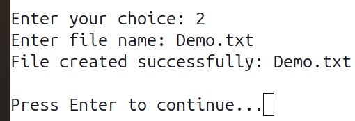
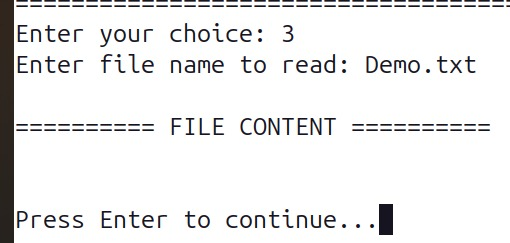
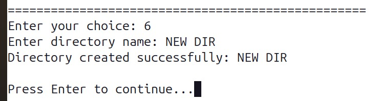
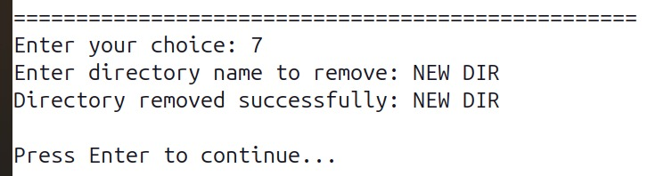
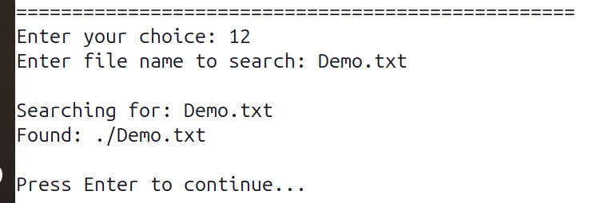
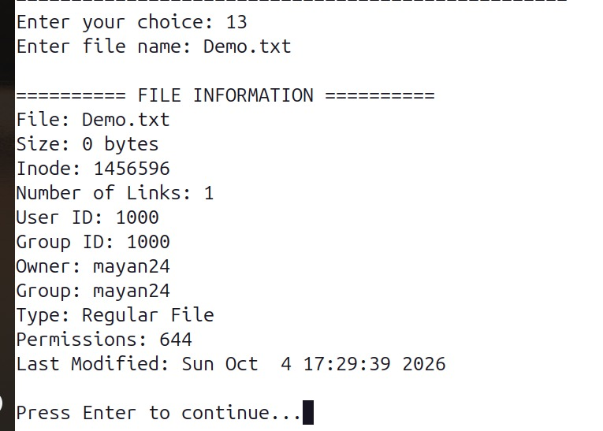
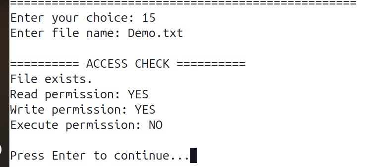

# Linux File Management Utility

A menu-driven **C++17 Linux File Management Utility** developed for **Linux/Ubuntu**. This project allows users to perform common file and directory operations through a simple command-line menu.

The project also demonstrates important **Linux/POSIX system programming concepts**, including file descriptors, file permissions, `lseek()`, `stat()`, `chmod()`, and `access()`.

---

##  Project Description

**Linux File Management Utility** is a command-line application written in C++17 for managing files and directories in a Linux environment.

The application provides a menu through which users can create, read, write, copy, move, rename, delete, and search files. It also provides directory management, file information, permission management, file descriptor monitoring, and an `lseek()` demonstration.

This project is designed to provide practical experience with **Linux system calls and POSIX APIs**.

---

##  Objectives

* Perform basic file operations.
* Perform directory operations.
* Search for files recursively.
* Display detailed file information.
* Change and check file permissions.
* Demonstrate Linux file descriptors.
* Demonstrate the `lseek()` system call.
* Understand Linux/POSIX system programming.
* Practice C++17 programming.
* Use a Makefile for compilation.
* Manage the project using Git/GitHub.

---

##  Features

The application provides the following 18 options:

1. **List Files**
2. **Create File**
3. **Read File**
4. **Write File**
5. **Append to File**
6. **Create Directory**
7. **Remove Directory**
8. **Delete File**
9. **Copy File**
10. **Move File**
11. **Rename File**
12. **Search File**
13. **File Information**
14. **Change Permissions**
15. **Check Permissions**
16. **`lseek()` Demonstration**
17. **File Descriptor Monitoring**
18. **Exit**

---

##  Technologies Used

* **C++17**
* **Linux / Ubuntu**
* **g++**
* **Linux/POSIX System Calls**
* **Makefile**
* **Git**
* **GitHub**

---

##  System Calls / APIs Used

| System Call / API | Purpose                                   |
| ----------------- | ----------------------------------------- |
| `open()`          | Opens or creates a file                   |
| `read()`          | Reads data from a file                    |
| `write()`         | Writes data to a file                     |
| `close()`         | Closes a file descriptor                  |
| `lseek()`         | Changes the file offset                   |
| `stat()`          | Retrieves file information                |
| `chmod()`         | Changes file permissions                  |
| `access()`        | Checks file accessibility and permissions |

---

##  Project Structure

```text
LinuxFileManager/
│
├── src/
│   ├── main.cpp
│   ├── file_operations.cpp
│   └── file_operations.h
│
├── docs/
│
├── screenshots/
│   ├── img1.png
│   ├── create-file.png
│   ├── read-write.png
│   ├── directory-operations.png
│   ├── search-file.png
│   ├── file-information.png
│   └── permissions.png
│
├── tests/
│
├── Makefile
├── README.md
└── .gitignore
```

---

##  Requirements

To build and run this project, you need:

* Linux / Ubuntu
* GNU C++ compiler (`g++`)
* `make`
* Git

Check whether the required tools are installed:

```bash
g++ --version
make --version
git --version
```

---

##  Installation

### 1. Clone the Repository

```bash
git clone https://github.com/YOUR-USERNAME/LinuxFileManager.git
```

Replace `YOUR-USERNAME` with your GitHub username.

### 2. Enter the Project Directory

```bash
cd LinuxFileManager
```

### 3. Compile the Project

```bash
make
```

If compilation is successful, the executable will be created.

---

##  Run the Program

Run the application using:

```bash
./filemanager
```

You can also use:

```bash
make run
```

if the `run` target is included in the Makefile.

---

##  Clean the Build

To remove the compiled executable:

```bash
make clean
```

---

##  Main Menu

When the program starts, it provides a menu similar to:

```text
========================================
      LINUX FILE MANAGEMENT UTILITY
========================================

1.  List Files
2.  Create File
3.  Read File
4.  Write File
5.  Append to File
6.  Create Directory
7.  Remove Directory
8.  Delete File
9.  Copy File
10. Move File
11. Rename File
12. Search File
13. File Information
14. Change Permissions
15. Check Permissions
16. lseek Demonstration
17. File Descriptor Monitoring
18. Exit

Enter your choice:
```

---

#  Screenshots

The following screenshots demonstrate the different features of the Linux File Management Utility.

## Main Menu



---

## File Operations



This screenshot demonstrates file creation and basic file operations.

---

## Read / Write / Append



This screenshot demonstrates reading, writing, and appending data to files.

---

## Directory Operations




This screenshot demonstrates creating and removing directories.

---

## Search File



This screenshot demonstrates recursive file searching.

---

## File Information



This screenshot demonstrates displaying file information using the `stat()` system call.

---

## File Permissions



This screenshot demonstrates checking and changing file permissions using `access()` and `chmod()`.

---

#  Linux Concepts Demonstrated

## File Descriptors

Linux represents opened files using **file descriptors**.

For example:

```cpp
int fd = open("example.txt", O_RDONLY);
```

The returned integer is the file descriptor.

The file descriptor can then be used with:

```cpp
read(fd, buffer, sizeof(buffer));
```

After completing the operation, it should be closed:

```cpp
close(fd);
```

---

## `lseek()`

The `lseek()` system call is used to change the current position of a file descriptor.

Example:

```cpp
off_t position = lseek(fd, 0, SEEK_END);
```

This can be used to move the file offset to the beginning, end, or a specific position.

---

## `stat()`

The `stat()` system call is used to retrieve information about a file.

It can provide information such as:

* File size
* File type
* File permissions
* Owner information
* Access time
* Modification time

Example:

```cpp
struct stat fileInfo;

stat("example.txt", &fileInfo);
```

---

## File Permissions

Linux uses permission bits to control access to files.

Example:

```text
-rwxr-xr--
```

This represents:

```text
Owner       Group       Others
rwx         r-x         r--
```

The project demonstrates permissions using:

```cpp
chmod()
```

and:

```cpp
access()
```

---

#  Testing

The `tests/` directory can be used for test files and test cases.

The following operations should be tested:

* Create a file
* Read a file
* Write to a file
* Append data
* Copy a file
* Move a file
* Rename a file
* Delete a file
* Create a directory
* Remove a directory
* Search for a file
* Display file information
* Change permissions
* Check permissions
* Test `lseek()`
* Test file descriptor operations

---

#  Error Handling

The application handles common file and directory errors such as:

* File not found
* Permission denied
* Invalid file path
* Invalid directory
* File already exists
* Directory does not exist
* Directory is not empty
* Unable to open a file
* Unable to read a file
* Unable to write to a file
* Invalid user input

Linux errors can be displayed using:

```cpp
perror("Error");
```

Example:

```cpp
int fd = open("file.txt", O_RDONLY);

if (fd == -1) {
    perror("open");
    return 1;
}
```

---

#  Makefile

The project uses a Makefile to simplify compilation.

A typical Makefile can contain:

```makefile
CXX = g++
CXXFLAGS = -std=c++17 -Wall -Wextra -pedantic

TARGET = filemanager

SRC = src/main.cpp src/file_operations.cpp

all:
	$(CXX) $(CXXFLAGS) $(SRC) -o $(TARGET)

run: all
	./$(TARGET)

clean:
	rm -f $(TARGET)
```

### Build

```bash
make
```

### Run

```bash
make run
```

### Clean

```bash
make clean
```

---

#  Learning Outcomes

This project provides practical experience with:

* C++17 programming
* Linux file management
* Linux system calls
* POSIX APIs
* File descriptors
* File permissions
* Directory operations
* File metadata
* `lseek()`
* `stat()`
* `chmod()`
* `access()`
* Error handling
* Makefiles
* Linux command-line programming
* Git and GitHub

---

#  Future Improvements

Possible future improvements include:

* Add a graphical user interface.
* Add colored terminal output.
* Add command history.
* Add file sorting.
* Add hidden-file support.
* Add wildcard-based file searching.
* Add recursive directory copying.
* Add recursive directory deletion.
* Add file size calculation.
* Add detailed logging.
* Add unit tests.
* Improve input validation.

---

#  Author

**Your Name**

GitHub: `https://github.com/YOUR-USERNAME`

---

#  License

This project is developed for **educational and academic purposes**.

---

##  Conclusion

The **Linux File Management Utility** is a practical Linux system programming project that demonstrates how C++ applications can interact with the Linux operating system.

It combines common file and directory operations with important Linux concepts such as **file descriptors, file permissions, `stat()`, `chmod()`, `access()`, and `lseek()`**.

The project provides hands-on experience with **C++17, Linux/POSIX system calls, Makefiles, and Git/GitHub**.
